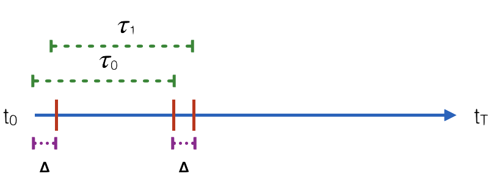

Subpath Analysis
==========================

Heteromotility's feature quantification tool may also be applied to **subpaths**
within the full time series. This is useful to quantify motility state transitions
within individual cells.

Subpath Feature Extraction
--------------------------

Subpath analysis is performed using the ``--detailedbalance`` CLI flag in the
``heteromotility`` tool. The argument following ``--detailedbalance`` is an
integer specifying the smallest length :math:`\tau` of each **subpath** to
analyze. ``heteromotility`` will calculate features for all **subpaths** between
this argument and ``T = total_length//2``. This behavior can be suppresed by
supplying a maximum **subpath** size to consider with ``--dbmax``.

Here, ```--detailedbalance 20 --dbmax 20`` specifies analysis of only subpaths
exactly :math:`\tau = 20` time units in length.

.. code-block:: bash

  heteromotility demo/ --tracksX demo/rw_x.csv --tracksY demo/rw_y.csv --detailedbalance 20 --dbmax 20

By default, ``heteromotility`` splits paths without any overlap, and places them
directly adjacent to one another in the time series.

**Default Path Splitting Behavior**

.. image:: default_path_split.png
  :height: 200 px
  :width: 600 px
  :alt: default path splitting diagram
  :align: center

``heteromotility`` also supports the use of **sliding windows**, splitting the full length
track into paths that differ only by a stride :math:`\Delta`. This behavior is invoked with the
``--sliding_window`` flag, which specifies the size of the stride :math:`\Delta` with an integer.

Here, ``--detailedbalance 20 --dbmax 20 --sliding_window 3`` specifies analysis of **subpaths**
length :math:`\tau = 20` with stride :math:`\Delta = 3`.

.. code-block:: bash

  heteromotility demo/ \
    --tracksX demo/rw_x.csv --tracksY demo/rw_y.csv \
    --detailedbalance 20 \
    --dbmax 20 \
    --sliding_window 3

**Sliding Window Path Splitting Behavior**



Output Data Format
------------------

Output statistics are saved in ``motility_statistics_split_TAU.csv``, where ``TAU`` is the size
of subpaths analyzed. The CSV has the same format as the static analysis export, with one key difference.

The ``cell_id`` column will now specify unique ``cell_ids`` as integers, as well
as the order of subpaths for each cell, separated by ``-``.

For instance, for a path with total length ``T = 80``, analysed with
**subpaths** length :math:`tau = 20`, the ``cell_ids`` column would appear as
follows:

.. code-block:: bash

    cell_ids ...
    obj0-0 ...
    obj0-1 ...
    obj0-2 ...
    obj0-3 ...
    obj1-1 ...
    obj1-2 ...
    ...

In this example, statistics associated with ``0-0`` are from the first subpath
(``0``) of the first tracked cell ``0``. Statistics associated with ``0-1`` are
from the second subpath (``1``) of the same cell ``0``, and so on.
